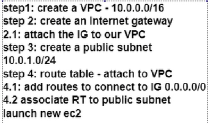
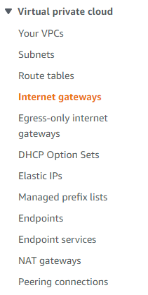
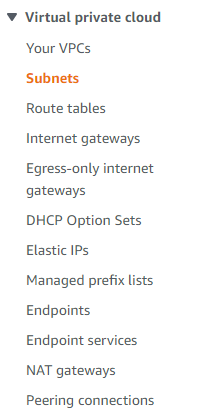
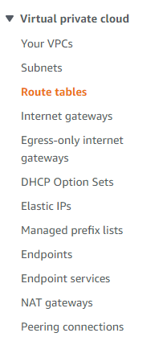
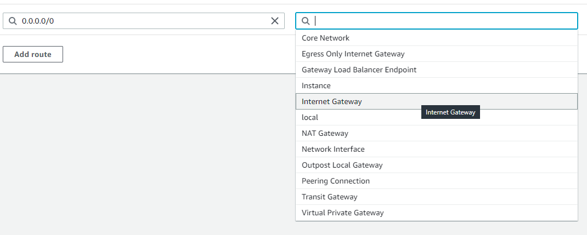

# Virtual Private Cloud

## What is a VPC
A VPC is a virtual network that closely resembles a traditional network that you'd operate in your own data center. After you create a VPC, you can add subnets.
An isolated secure environment which limits access. Least privilaged access

## What are subnets
A subnet is a range of IP addresses in your VPC. A subnet must reside in a single Availability Zone. After you add subnets, you can deploy AWS resources in your VPC.
A subnetwork or subnet is a logical subdivision of an IP network. The practice of dividing a network into two or more networks is called subnetting.
Computers that belong to the same subnet are addressed with an identical most-significant bit-group in their IP addresses. 

## What is an Internet Gateway
A computer that sits between different networks or applications. The gateway converts information, data or other communications from one protocol or format to another. A router may perform some of the functions of a gateway. An Internet gateway can transfer communications between an enterprise network and the Internet.

## What is a route table
A route table contains a set of rules, called routes, that determine where network traffic from your subnet or gateway is directed.

## What is a CIDR (Classless Inter-Domain Routing) block
Classless Inter-Domain Routing is a method for allocating IP addresses and for IP routing.
CIDR is principally a bitwise, prefix-based standard for the representation of IP addresses and their routing properties. It facilitates routing by allowing blocks of addresses to be grouped into single routing table entries. These groups, commonly called CIDR blocks, share an initial sequence of bits in the binary representation of their IP addresses.

## What are NACLs
A network access control list (NACL) is an optional layer of security for your VPC that acts as a firewall for controlling traffic in and out of one or more subnets. You might set up network ACLs with rules similar to your security groups in order to add an additional layer of security to your VPC.

## Steps to connect and create VPC to app on cloud

1. Create a VPC
   1. Go to the VPC service and click on "Create VPC"
   2. Select "VPC only" option
   3. Name it according to a naming convention
   4. Provie IPv4 CIDR (i.e. 10.0.0.0/24)
2. Create an "Internet Gateway"
   1. Select this option from the VPC tab
   2. 
   3.  Click "Create internet gateway"
   4.  Name it accordingly (follow naming conventions) 
   5.  Status on Internet gateway should still be detached
   6.  To attach your route table to your VPC do the following
       1.  Go to the Internet gateway tab and select your IG
       2.  Go to Actions -> Attach to VPC
3.  Create public subnet
    1. Select this option  
    2. 
    3. Click Create subnet
    4. Select your VPC
    5. Name it, following conventions (make sure to specify this is the public one)
4.  Create and attach a Routing Table
    1.  Select this option
    2.  
    3.  Name your routing table accoring to conventions
    4.  Specify your VPC
    5.  Create it
    6.  Add a route to connect to IG 0.0.0.0/0
    7.  
5.  Associate RT with public subnet
    1.  From the Route Table tab, go to the Subnet Associations block
    2.  Click "Edit subnet associations"
    3.  Select the subnet you just made (public one)
    4.  RT and public subnet are now linked
6.  Launch new EC2 instance
    1.  Go to EC2 tab
    2.  Click Launch Instance
    3.  Refer to this(https://github.com/AGelemerov/Eng130-CloudComputing#setup-vm-instance-on-aws) to setup if unsure
    4.  On the Network stage click "Edit"
    5.  Enter the VPC you just created
    6.  Make sure to ENABLE the "Auto-assign public IP" option
    7.  Create Security group to allow HTTP traffic and SSH (Only for public subnet)
    8.  Make sure SSH Source Type is "My IP"
    9.  This EC2 instance is part of the public subnet
7.  Follow step 5 to create a private subnet
    1.  You will need a new routing table
    2.  You will NOT need to create and link any internet gateway to this
8.  Follow step 6 and create a new instance for you database
    1.  Specify your VPC and the PRIVATE subnet this time
    2.  As step 6.6 says to enable for public, you will need to disable this option for the private subnet instances
    3.  While creating the new security group, you will need to specify the private IPv4 address of the public subnet instance in order to grant access(port will be dependant on your database choice, for mongodb it will be 27017)
        1.  Name it accordingly and ensure you meantion it is for the private subnet
    4.  Launch the instance
9.  Link database instance with app instance
    1.  Connect to the app instance via SSH in a Git Bash terminal
    2.  Specify the DB_HOST environment variable (https://github.com/AGelemerov/Eng130_Virtualisation#linking-app-and-db-)
    3.  The IP should be the private IPv4 IP address of the database instance
10. You are all set
    1.  All that is left is to seed the database from the app instance (e.g. `node seeds/seed.js`)
    2.  Run `npm start`