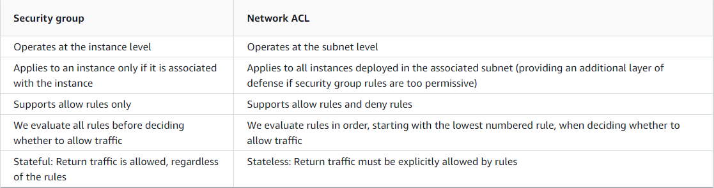

# Virtual Private Cloud

## What is a VPC
A VPC is a virtual network that closely resembles a traditional network that you'd operate in your own data center. After you create a VPC, you can add subnets.

## What are subnets
A subnet is a range of IP addresses in your VPC. A subnet must reside in a single Availability Zone. After you add subnets, you can deploy AWS resources in your VPC.
A subnetwork or subnet is a logical subdivision of an IP network. The practice of dividing a network into two or more networks is called subnetting.
Computers that belong to the same subnet are addressed with an identical most-significant bit-group in their IP addresses. 

## What is an Internet Gateway
A computer that sits between different networks or applications. The gateway converts information, data or other communications from one protocol or format to another. A router may perform some of the functions of a gateway. An Internet gateway can transfer communications between an enterprise network and the Internet.

## What is a route table
A route table contains a set of rules, called routes, that determine where network traffic from your subnet or gateway is directed.

## What is a CIDR (Classless Inter-Domain Routing) block
Classless Inter-Domain Routing is a method for allocating IP addresses and for IP routing.
CIDR is principally a bitwise, prefix-based standard for the representation of IP addresses and their routing properties. It facilitates routing by allowing blocks of addresses to be grouped into single routing table entries. These groups, commonly called CIDR blocks, share an initial sequence of bits in the binary representation of their IP addresses.

## What are NACLs
A network access control list (NACL) is an optional layer of security for your VPC that acts as a firewall for controlling traffic in and out of one or more subnets. You might set up network ACLs with rules similar to your security groups in order to add an additional layer of security to your VPC.
